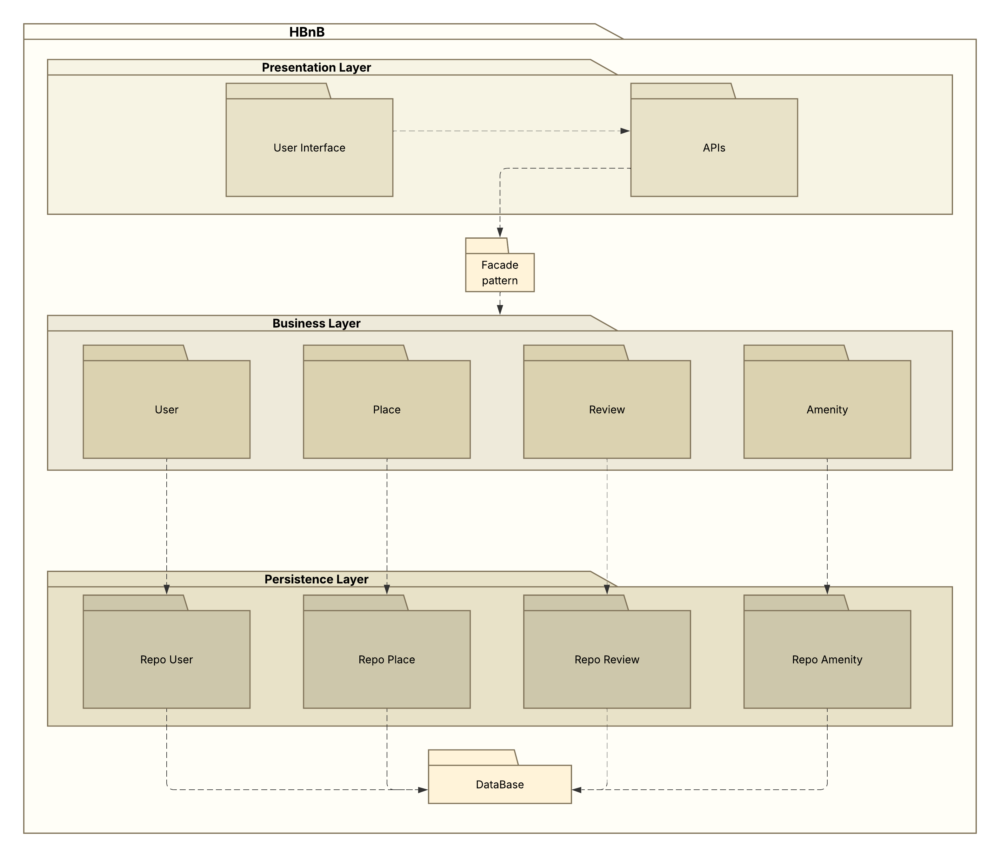
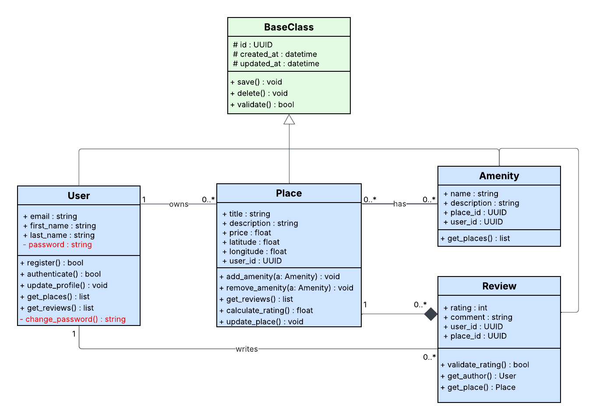

HBnB API (Part 3)
=================

Overview
--------
Part 3 provides a REST API for HBnB with:
- Flask + Flask-RESTX for HTTP API and Swagger docs.
- SQLAlchemy + SQLite persistence.
- JWT authentication and role-based authorization.
- Business layer with a Facade (`app/services/facade.py`).

Interactive API docs are available at:
- `http://localhost:5000/api/v1/`

Project structure
-----------------
- `app/api/v1/`: endpoints (`users`, `amenities`, `places`, `reviews`, `auth`).
- `app/models/`: SQLAlchemy entities and validations.
- `app/persistence/repositories/`: repository layer by entity.
- `app/services/facade.py`: business rules and orchestration.
- `run.py`: app launcher + admin bootstrap.
- `tests/test_api_v1_full.py`: integration API tests.

Implemented features
--------------------
- JWT login via `/api/v1/auth/login`.
- Automatic admin bootstrap at startup (`admin@hbnb.com`).
- User registration (public) and admin user update.
- Amenity creation/update reserved to admin.
- Place CRUD with ownership checks:
    - Place creation by authenticated users.
    - Update/delete allowed to place owner or admin.
- Review CRUD with business constraints:
    - Authenticated users can review places.
    - A user cannot review their own place.
    - A user cannot review the same place twice.
    - Update/delete allowed to review author or admin.
- Validation rules in models:
    - Email format.
    - Non-empty fields.
    - `rating` in `[1..5]`.
    - `latitude` in `[-90..90]`, `longitude` in `[-180..180]`.
    - `price >= 0`.

Authentication and authorization
--------------------------------
- Login returns a JWT token:
    - `POST /api/v1/auth/login`
- Protected routes use `Authorization: Bearer <token>`.
- Role rules:
    - `is_admin=True`: can manage amenities and update any user.
    - owner/author rules enforced for places and reviews.

API endpoints
-------------
Base path: `/api/v1`

Auth
- `POST /auth/login`: authenticate and get `access_token`.

Users
- `POST /users/`: create user (public registration; `is_admin` only honored for admin callers).
- `GET /users/`: list users.
- `GET /users/<user_id>`: get user details.
- `PUT /users/<user_id>`: admin only.

Amenities
- `POST /amenities/`: admin only.
- `GET /amenities/`: list amenities.
- `GET /amenities/<amenity_id>`: get amenity details.
- `PUT /amenities/<amenity_id>`: admin only.

Places
- `POST /places/`: authenticated user creates a place (owner forced from JWT identity).
- `GET /places/`: list places.
- `GET /places/<place_id>`: get place details (owner, amenities, reviews).
- `PUT /places/<place_id>`: owner or admin.
- `DELETE /places/<place_id>`: owner or admin.
- `GET /places/<place_id>/reviews`: list reviews for a place.

Reviews
- `POST /reviews/`: authenticated user creates a review.
- `GET /reviews/`: list reviews.
- `GET /reviews/<review_id>`: get review details.
- `PUT /reviews/<review_id>`: author or admin.
- `DELETE /reviews/<review_id>`: author or admin.

Quick start
-----------
1. Install dependencies:
     - `pip install -r requirements.txt`
2. Run API:
     - `python run.py`
3. Open Swagger:
     - `http://127.0.0.1:5000/api/v1/`

Default admin user
------------------
At startup, if missing, an admin user is created automatically:
- email: `admin@hbnb.com`
- password: `admin/12345`

Tests
-----
- `python -m unittest discover -s tests -p "test_api_v1_full.py"`

Part 1 diagrams
---------------
The diagrams from Part 1 are referenced below.

Package diagram:

Class diagram:

Database diagram:

Sequence diagram - User registration:

Sequence diagram - Place creation:

Sequence diagram - Review submission:

Sequence diagram - Fetching list of places:

Authors
-------
Mahmoud Bouate
Lucas Podevin
Holberton School - HBnB Project
